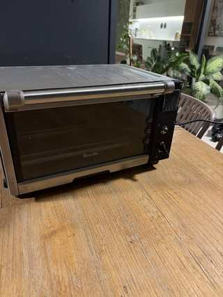
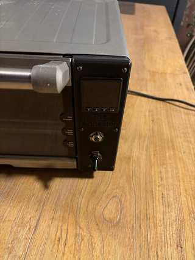
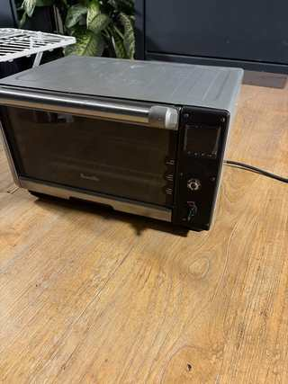

# Breville BOV650 Community Build

This build was created by a community member using the **ThermaVault PID build guide as the starting point** and adapting the design to a **Breville BOV650**.

The BOV650 chassis uses a different front/control-area layout than the original project, so this version uses a model-specific control faceplate while keeping the same overall ThermaVault concept.

---

## Photos

### Front / overall view

  

### Control panel

  

### Angled view

  

---

## BOV650-Specific CAD

The model-specific front control plate is available here:

**[FacePlate_BOV650.step](../../../CAD%20Models/FacePlate_BOV650.step)**

---

## Notes

- Platform: **Breville BOV650**
- Based on: **ThermaVault PID build guide**
- Adaptation type: Model-specific enclosure/control-panel conversion
- The photos above document a community implementation rather than the original reference oven.

Because factory construction and revisions can vary, verify all dimensions against the actual oven before manufacturing parts. Electrical ratings, grounding, fusing, thermal cutoffs, wire temperature ratings, and SSR/heater sizing also need to be checked for the specific unit being converted.

---

[← Back to Community Builds](../README.md)
